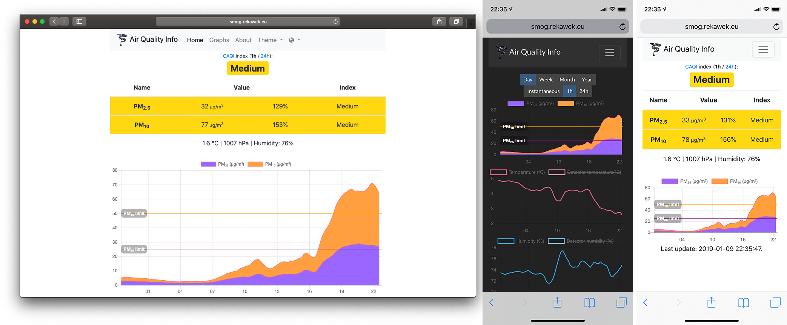

# Air Quality Info

This PHP-based page allows to display the current PM10 and PM2.5 measurements made by the Luftdaten.info-compatible device.



[Live demo](http://smog.rekawek.eu/)

See the README in <a href="README-pl.md">Polish</a>.

## Features

* Nice and clean interface
* Records stored in the RRD or MySQL
* Graphs rendered with ChartJS
* No external database required
* Support for multiple devices
* Locale support

## Requirements

* PHP 7
* php-rrd extension or MySQL access

## Resources

* [Nettigo Air Monitor](https://easyeda.com/nettigo/Nettigo-Air-Monitor/)
* [Luftdaten](https://luftdaten.info/)
* [Forum thread on the app](https://forum.kodujdlapolski.pl/t/strona-informacyjna-dla-czujnika-luftdaten/3217/35) (in Polish)

## Deployment script

[install.sh](install.sh) is an interactive script can be used to setup nginx, PHP and Air Quality Dashboard on a Linux server. It can be run with two commands:

```
curl https://raw.githubusercontent.com/trekawek/air-quality-info/master/install.sh > /tmp/install.sh
bash -e /tmp/install.sh
```

Remember to review the script before running the command below.

The supported Linux distributions:

* Debian 9 Stretch
* Raspbian 9 Stretch
* Ubuntu 18.04 Bionic

## Manual deployment

### Web server configuration

The web server should redirect all the requests for unknown paths to the [htdocs/index.php](src/htdocs/index.php). For Apache2, there's already a [.htaccess](src/htdocs/.htaccess) file (requires mod_rewrite). For the nginx, there's a [sample configuration available](docs/sample-nginx.conf).

### Deployment

1. Checkout or download the repository.
2. Copy the [htdocs/config-empty.php](src/htdocs/config-empty.php) to `config.php`. Edit the username, password and the device id.
3. Upload the files from the [htdocs](src/htdocs) directory to the web server.
4. Make sure that the web server has permissions to create files in the [htdocs/data](src/htdocs/data) directory.
5. Configure the Wemos-based detector to send data to the *own API*. Use username and password the same as in the `config.php`. The path should reference the path: `/main/update`, where the `main` matches the device name set in `config.php`.

### Using MySQL

By default, the site will use RRD. MySQL database can be configured as follows:

1. Create the database:
```
CREATE DATABASE air_quality_info;
```
2. Create the user and grant him the privileges:
```
GRANT ALL PRIVILEGES ON air_quality_info.* TO 'air_quality_info'@'localhost' IDENTIFIED BY '<enter password here>';
```
3. Import [mysql-schema.sql](src/mysql-schema.sql):
```
mysql -u air_quality_info -p air_quality_info < mysql-schema.sql
```
These steps can be also done with the phpmyadmin.

4. Update the `config.php`: change the `db.type` to `mysql` and fill the properties specific for the MySQL.
